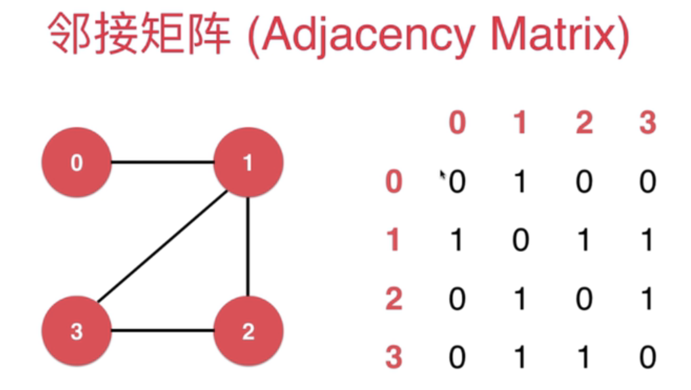
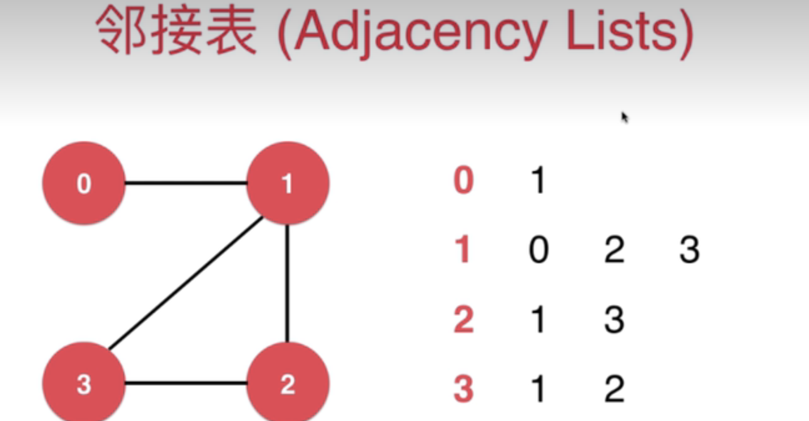
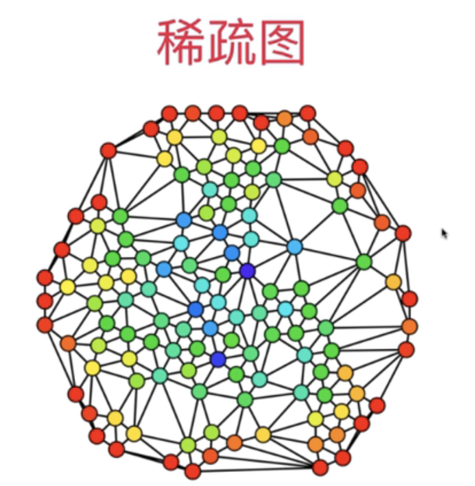
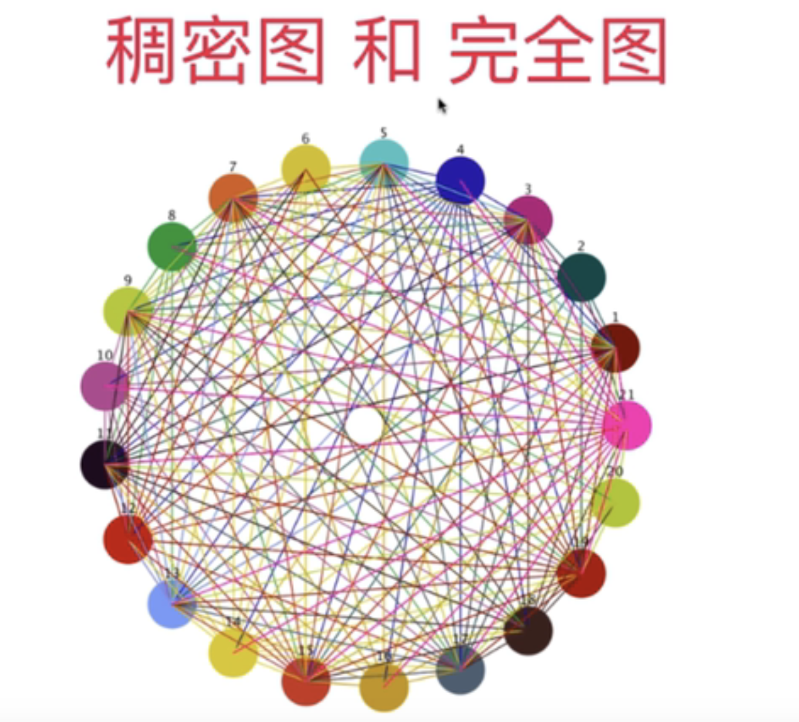

[# 图啊图](https://www.bilibili.com/video/BV1Pf4y1s7u1/)

## 邻接表

邻接表适合表示`稀疏图`(Sparse Graph)

## 邻接矩阵

邻接矩阵适合表示`稠密图`(Dense Graph)

- 个人理解,稠密图中需要每个点都与图中的其他所有点的大部分都相连,才能称为稠密图
- 即使一个图,点很多,铺开也很大,但每个点都只与身边几个点相连,也只是稀疏图
- `完全图`比较适合使用邻接矩阵来表示

## 邻接矩阵 

C++实现:
- dense_graph.h 
- dense_graph_test.cpp

## 邻接表

C++实现:
- sparse_graph.h
- sparse_graph_test.cpp

## 读取文件构建图

C++实现:
- read_graph.h 
- read_graph_test.cpp

## 图的深度优先遍历

C++实现(求图的连通分量):
- graph_dfs.h
- graph_dfs_test.cpp

C++实现(寻路):
- path.h

## 图的深度优先遍历的时间复杂度

邻接表 O(V+E)

邻接矩阵 O(V^2)

## 图的广度优先遍历

`广度优先遍历`可以得到`无权图`的`最短路径`

C++实现:
- shortest_path.h
- shortest_path_test.cpp

Python实现:
- py/graph_demo.py

## 无权图算法汇总

C++实现:
- unweighted_graph.h
- unweighted_graph_test.cpp

Python实现:
- py/sparse_graph.py

## 有权图

C++实现:
- edge.h
- weight_dense_graph.h
- weight_sparse_graph.h
- weight_read_graph.h
- weight_read_graph_test.cpp

Python实现:
- py/edge.py
- py/weight_sparse_graph.py

## 有权图 Prim 算法求最小生成树

C++实现:
- min_heap.h
- lazy_prim_mst.h
- lazy_prim_mst_test.cpp

C++实现(Prim 算法优化):
- index_min_heap.h
- prim_mst.h
- prim_mst_test.cpp

## 有权图 Krusk 算法求最小生成树

待补充

## 有权图 Dijkstra 算法求最短路径

待补充
